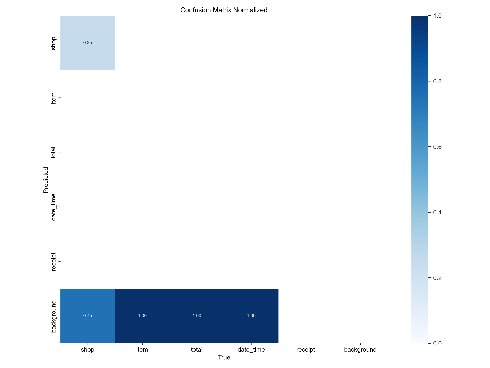
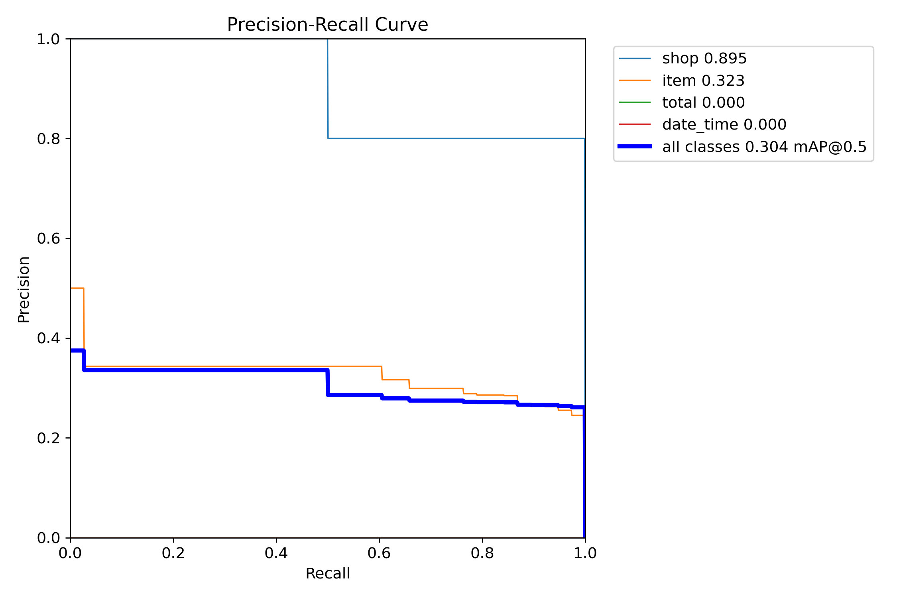
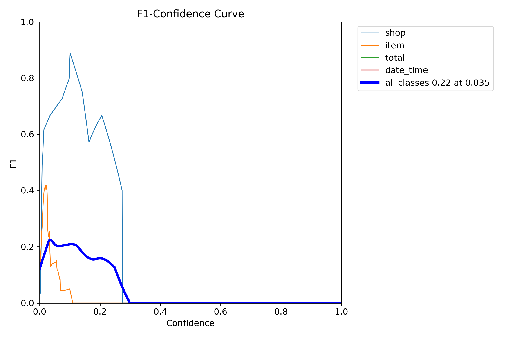
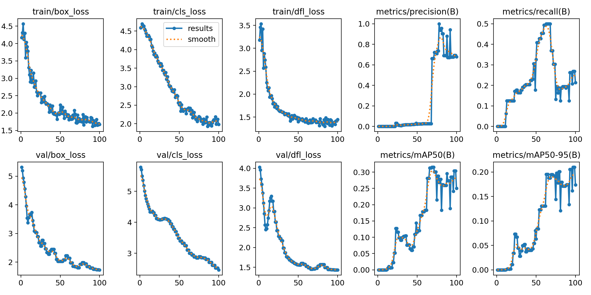

# **Recipify**

**Recipify** is a powerful receipt data extraction tool that combines **YOLO11** for object detection and **Tesseract OCR** for text recognition. It automatically extracts key information from receipt images, such as vendor names, total amounts, items, and dates, to help you keep track of your expenses.

---

## **Features**
- **YOLO11 Object Detection**: Detects receipt elements like shop names, total amounts, dates, and items.
- **Tesseract OCR**: Extracts textual data from the receipt images.
- **Advanced Preprocessing**: Enhances image quality for better OCR and object detection.
- **Dataset Conversion**: Converts annotated receipt datasets into YOLO format for training.
- **CLI Support**: Easy-to-use command-line interface for running the demo.

---

## **Setup and Installation**

### **1. Clone the Repository**
```bash
git clone https://github.com/subhashhhhhh/Recipify.git
cd Recipify
```

### **2. Set Up a Virtual Environment**
Create and activate a Python virtual environment:
```bash
python -m venv recipify_env
source recipify_env/bin/activate  # On Windows: recipify_env\Scripts\activate
```

### **3. Install Recipify**
Install the project and its dependencies:
```bash
pip install -e .
```

---

## **Usage**

### **1. Run the Demo**
To process a receipt image and extract details:
```bash
recipify-demo --image <path_to_receipt_image> --weights <path_to_yolo_weights>
```

Example:
```bash
recipify-demo --image example_receipt.jpg --weights yolo11n.pt
```

### **2. Train the YOLO11 Model**
If you want to train YOLO11 on a custom dataset:
1. Ensure your dataset is structured as follows:
   ```
   dataset/
   ├── train/
   │   ├── images/
   │   └── labels/
   ├── val/
   │   ├── images/
   │   └── labels/
   ```

2. Update `dataset.yaml`:
   ```yaml
   train: dataset/train/images
   val: dataset/val/images
   nc: 5
   names: ['shop', 'item', 'total', 'date_time', 'receipt']
   ```

3. Train the model:
   ```bash
   python -m ultralytics.yolo train --data dataset.yaml --weights yolo11n.pt --epochs 50
   ```

---

## **Folder Structure**
```
Recipify/
├── recipify/
│   ├── __init__.py
│   ├── preprocessing.py       # Image preprocessing for OCR
│   ├── ocr.py                 # Text extraction using Tesseract
│   ├── classification.py      # Receipt type classification
│   ├── extraction.py          # Data parsing and extraction
│   ├── dataset_processing.py  # Convert annotations to YOLO format
│   ├── train.py
│   ├── dataset.yaml
├── dataset/                   # Custom dataset (images and labels)
├── requirements.txt           # Python dependencies
├── setup.py                   # Installation configuration
└── README.md                  # Project documentation
```

---

## **Model Evaluation**

### **Confusion Matrix**


### **Precision-Recall Curve**


### **F1-Score Curve**


### **Loss Curves**


---

## **Development and Contribution**

### **Testing**
- Run tests with `pytest`:
  ```bash
  pytest
  ```

### **Contributions**
Contributions are welcome! To contribute:
1. Fork the repository.
2. Create a new branch:
   ```bash
   git checkout -b feature-branch
   ```
3. Commit your changes:
   ```bash
   git commit -m "Add a new feature"
   ```
4. Push the branch:
   ```bash
   git push origin feature-branch
   ```
5. Open a pull request.

---

## **Dependencies**
- **Python 3.9+**
- **YOLO11**: Ultralytics for object detection.
- **Tesseract OCR**: For text extraction.
- **SpaCy**: For named entity recognition (NER).
- **OpenCV**: For image preprocessing.

Install all dependencies via:
```bash
pip install -r requirements.txt
```

---

## **Acknowledgments**
- **Ultralytics**: For the YOLO11 model.
- **Google**: For Tesseract OCR.
- **OpenCV**: For powerful image processing capabilities.
- **Community**: For contributing open datasets for receipts.

---

## **License**
This project is licensed under the [MIT License](LICENSE).
